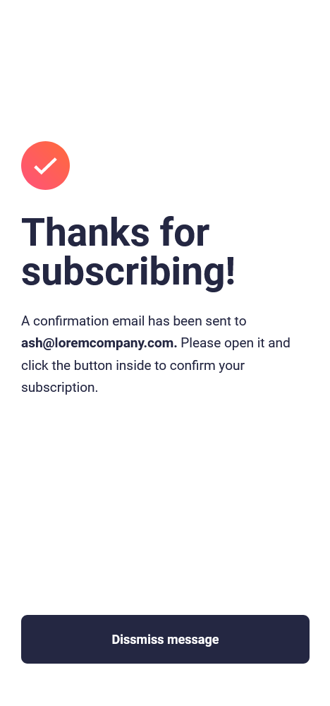

# Frontend Mentor - Newsletter sign-up form with success message


## Welcome 👋

This is a solution to the [Newsletter signup form challenge on Frontend Mentor](https://www.frontendmentor.io/challenges/newsletter-signup-form-with-success-message-3FC1AZbNrv). Frontend Mentor challenges help you improve your coding skills by building realistic projects.

## Table of contents 📑

- [Overview 🌟](#overview-🌟)
  - [The Challenge 🧪](#the-challenge-🧪)
  - [Screenshots 📷](#screenshots-📷)
  - [Links 🔗](#links-🔗)
- [My process 🏗️](#my-process-🏗️)
  - [Built with 🛠️](#built-with-🛠️)
  - [What I learned 🧠](#what-i-learned-🧠)
  - [Useful resources 📚](#useful-resources-📚)
- [Acknowledgments 🙏](#acknowledgments-🙏)
- [Contact 📧](#contact-📧)
- [Author 👤](#author-👤)

## Overview 🌟

### The Challenge 🧪

Users should be able to:

- ✅ Add their email and submit the form
- ✅ See a success message with their email after successfully submitting the form
- ✅ See form validation messages if:
  - ✅ The field is left empty
  - ✅ The email address is not formatted correctly
- ✅ View the optimal layout for the interface depending on their device's screen size
- ✅ See hover and focus states for all interactive elements on the page

### Screenshots 📷

_My solution (Desktop):_


_NB: I make the card a bit smaller by setting a `max-height` for the image. This is so it looks good even on narrower desktop screens(like mine)_

_Success (Desktop):_


_My solution (Mobile)_


_Success (Mobile):_



### Links 🔗

- Solution repo on github [here](https://github.com/BeanyTheCoder/newsletter-sign-up-with-success-message-main)
- Solution link on Front End Mentor: [here](https://www.frontendmentor.io/solutions/newsletter-signup-form-with-success-message-WJWYfDTJDR)
- Live site link: [here](https://beanythecoder.github.io/newsletter-sign-up-with-success-message-main/)

## My process 🏗️

### Built with 🛠️

- HTML & CSS
- JavaScript(Regex and Form Validation)

### What I learned 🧠

I learned a bit on form validation, specifically regular expressions(_regex_) and how to handle form submits

```js
// some simple regex code, that selects every character from A-Z:

let text = "I have 3 apples and 5 bananas.";

let numberRegex = /\d+/g;
let numberMatches = text.match(numberRegex);

console.log(numberMatches); // Output: ["3", "5"]
```

In the above example, the regex `\d+` matches one or more digits (0-9) in the text. The `g` flag is used to find all occurrences of the pattern in the input string.

---

Also learned the `:valid` and `:invalid` pseudoclasses, which I never knew existed!

```css
input:valid {
  color: green;
}

input:invalid {
  color: red;
}
```

---

I also organised my files a bit more than in other projects _(because of the 2 html, css and js files i use instead of the usual 1)_

### Useful resources 📚

- [RegExr](https://regexr.com/) - This helped me play around with the RegEx syntax and gave me a good grip on it. Be sure to check em' out.

## Contact 📧

- Frontend Mentor - [@BeanyTheCoder](https://www.frontendmentor.io/profile/BeanyTheCoder)
- Github - [BeanyTheCoder](https://github.com/BeanyTheCoder)

## Author 👤

My name is Alexander Afoko Jnr. and I am a passionate 13-year-old frontend developer from Ghana.
I hope to build up my portfolio and take my skills to the next level.
